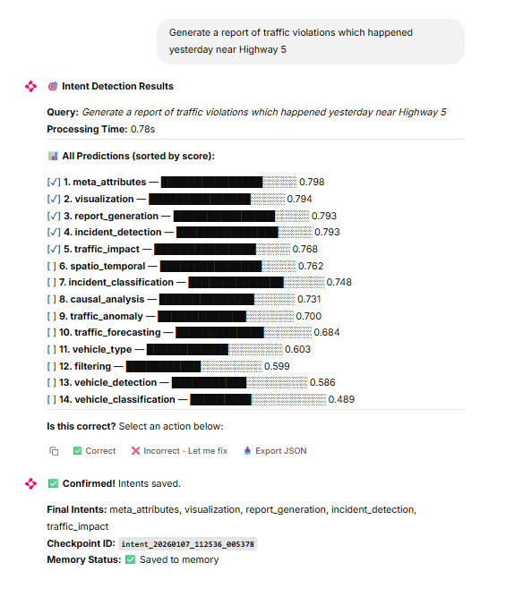
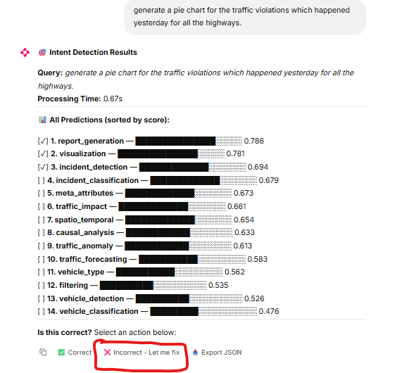
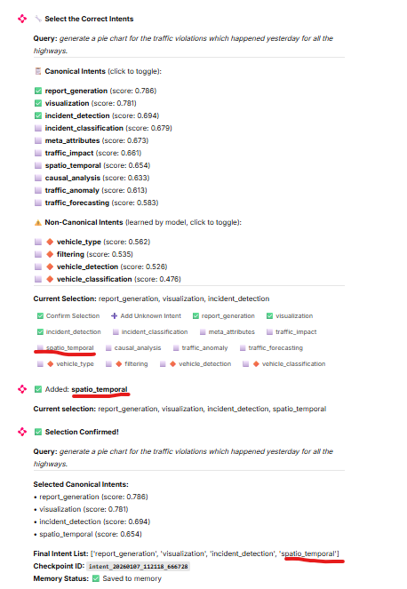

### Test steps :
1. activate the virtual environment (this is one time)
    ```
    .\d_venv\Scripts\Activate.ps1
    ```
2. pip install the requirements (this is one time)
    ```
    pip install -r .\DAA-Collab\requirements.txt
    ```
3. Generate JWT secret (one time)
    ```
    d_venv\Scripts\chainlit.exe create-secret
    ```
    Copy the generated secret to `DAA-Collab\.env`:
    ```
    CHAINLIT_AUTH_SECRET="<your-generated-secret>"
    ``

4. then run the build centroid script 
    ```
    python .\utils\ML\ml_based_intent_classification\build_centroids_script.py   
    ```
    - What this does:
        - Loads the Qwen embedding model (~15 seconds)
        - Processes training data
        - Generates intent centroids
        - Saves to intent_centroids.joblib and intent_classes.joblib

5. and finally start Chainlit Server
    ```
    chainlit run .\DAA-Collab\app_chainlit.py 
    ```
    - Expected behavior:
      - Models start loading (10-15 seconds first time)
      - Server starts at http://localhost:8000
      - Console shows: "Your app is available at http://localhost:8000"

5. check the results in http://localhost:8000/

### Response example :


### User feedback feature :

If the intents given by the model is not correct, user can modify or add the new intent tags.

#### Example :
1. example query :


2. user feedback :


