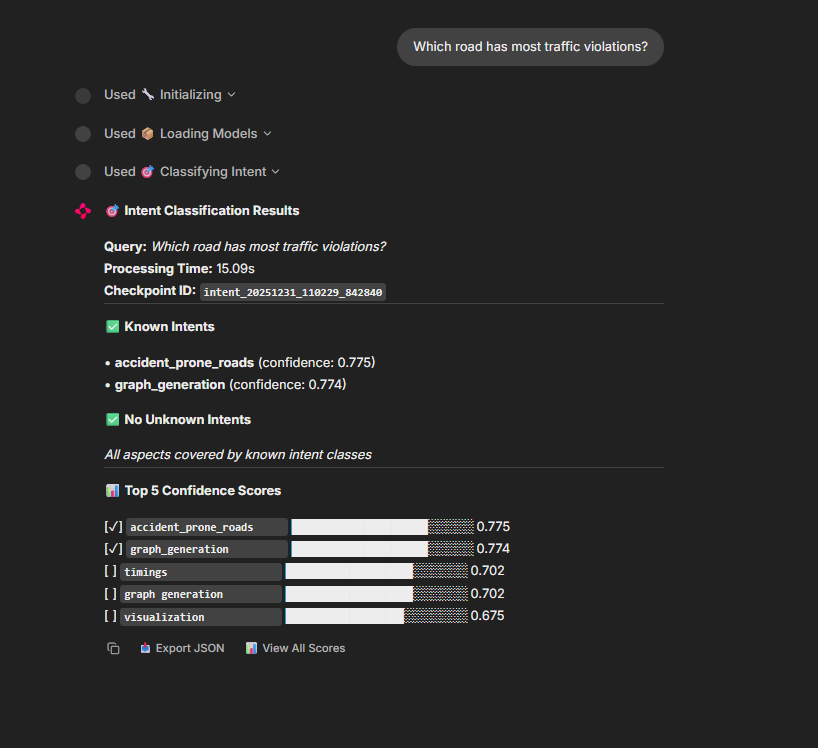
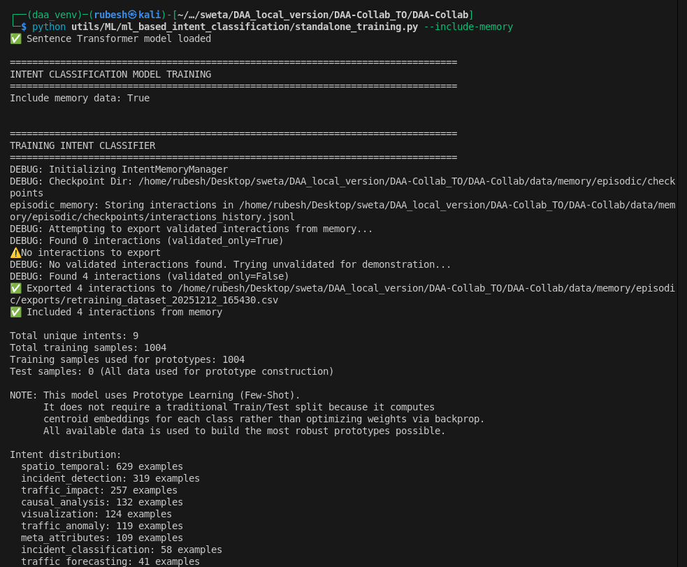
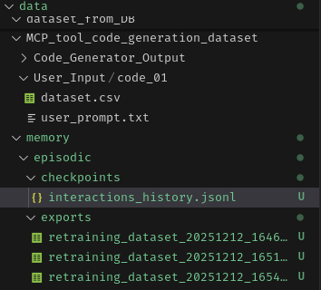

# DAA-Collab

# for training 

```bash
python -m venv <name>
.\<name>\Scripts\activate
or 
source .\<name>\Scripts\activate
pip install -r  .\DAA-Collab\requirements.txt
python .\DAA-Collab\utils\ML\ml_based_intent_classification\standalone_training.py
```

### Prerequisites
```bash
pip install spacy sentence-transformers
python -m spacy download en_core_web_sm
```

### Project Structure

```
DAA-Collab/
├── data/
│   ├── dataset_from_DB_Agent/
│   ├── MCP_tool_code_generation_dataset/
│   └── user_prompt_dataset/
├── func/
│   ├── graph/
│   │   └── graph_build.py
│   ├── memory/
│   ├── nodes/
│   │   ├── execute_node.py
│   │   ├── intent_classifier_node.py
│   │   ├── mcp_tool_generator_node.py
│   │   ├── planner_node.py
│   │   ├── tool_registration_node.py
│   │   └── update_instruction_node.py
│   ├── runner/
│   │   └── run.py
│   └── state/
│       └── agent_state.py
├── utils/
│   ├── mcp_tools_registry/
│   │   ├── generated_tools/
│   │   ├── static_tools/
│   │   └── smart_mcp_tool_lookup.py
│   ├── ML/
│   │   ├── ml_based_intent_classification/
│   │   │   ├── intent_classification.py
│   │   │   ├── model.py
│   │   │   └── saved_models_transformer/
│   │   ├── mcp_tool_generation/
│   │   │   └── mcp_tool_generation.py
│   │   └── common.py
│   └── common.py
├── main.py
├── README.md
├── .env
├── requirements.txt
└── langgraph.json
```

### ML-Based Intent Classification

#### Supported Intent Types

The system uses **Sentence Transformers** for semantic intent classification with the following categories:

| Intent | Description | Example Count |
|--------|-------------|---------------|
| `spatio_temporal` | Spatial/temporal patterns, locations, time-based analysis | 626 |
| `incident_detection` | Detecting accidents, crashes, breakdowns | 315 |
| `traffic_impact` | Delays, congestion, travel time impacts | 254 |
| `causal_analysis` | Understanding why/causes/reasons | 129 |
| `visualization` | Charts, graphs, displays | 121 |
| `traffic_anomaly` | Unusual patterns, anomalies, outliers | 118 |
| `meta_attributes` | Weather, external factors | 106 |
| `incident_classification` | Severity levels, incident types | 56 |
| `traffic_forecasting` | Predictions, forecasts, future trends | 41 |

#### Model Architecture

- **Embedding Model**: `all-MiniLM-L6-v2` (Sentence Transformers)
- **Classification Method**: Semantic similarity with cosine distance
- **Training**: Creates prototype embeddings from training examples (100 samples per intent)
- **Inference**: Compares user prompt embedding with intent prototypes
- **Threshold**: Default 0.50 (adjustable for precision/recall tradeoff)

#### Example Usage

**Input:**
```
"what are the traffic incident today in the JE side on road? Give a visualisation of the timeline as well."
```

**Output:**

```bash
✅ Sentence Transformer model loaded

Original prompt: what are the traffic incident today in the JE side on road? 
                 Give a visualisation of the timeline as well. 

Cleaned prompt: what are the traffic incident today in the je side on road? 
                give a visualisation of the timeline as well. 
```

**Semantic Similarity Scores:**

| Intent | Similarity Score | Detected |
|--------|-----------------|----------|
| `traffic_impact` | 0.635 | ✅ |
| `causal_analysis` | 0.624 | ✅ |
| `incident_detection` | 0.619 | ✅ |
| `visualization` | 0.610 | ✅ |
| `spatio_temporal` | 0.581 | ✅ |
| `incident_classification` | 0.569 | ✅ |
| `meta_attributes` | 0.521 | ✅ |
| `traffic_anomaly` | 0.402 | ❌ |
| `traffic_forecasting` | 0.351 | ❌ |

**Final Classification:**

```json
{
  "spatio_temporal": true,
  "traffic_impact": true,
  "meta_attributes": true,
  "incident_detection": true,
  "visualization": true,
  "traffic_anomaly": false,
  "incident_classification": true,
  "traffic_forecasting": false,
  "causal_analysis": true
}
```

#### Features

- ✅ **Semantic Understanding**: Captures meaning beyond keyword matching
- ✅ **Multi-Label Classification**: Can detect multiple intents simultaneously
- ✅ **Negation Handling**: Removes negated terms ("do not detect anomalies")
- ✅ **Offline Capable**: Works air-gapped after initial model download
- ✅ **Explainable**: Provides similarity scores for all intents
- ✅ **Adjustable Threshold**: Tune precision vs recall based on use case

#### Testing

```bash
python DAA-Collab/test.py \
  --instruction "your query here" \
  --file "DAA-Collab/data/user_prompt_dataset/traffic_prompts_realistic_option2_FIXED.csv"
```

#### Model Performance

- **Training Time**: ~30 seconds (one-time)
- **Inference Time**: ~50ms per query
- **Model Size**: ~90MB (cached after first download)
- **Accuracy**: Semantic similarity > 0.5 indicates relevant intent





# Training the embedding model with the past user prompts - memory 




This is done by adding the checkpoints for each user interaction and intent classifier output:

